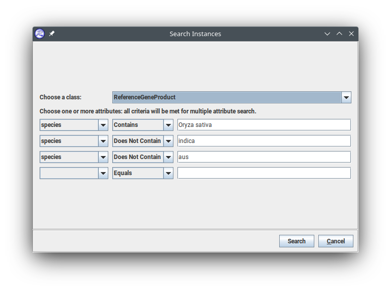

# Data exports

## Generate preliminary stats on projection spreadsheet

On the same google sheet that new species were added in the "Data gathering" section, https://docs.google.com/spreadsheets/d/1GB_WdHW_lVEZwkmd1MPijas-iQIAL8qP7ljNNKhv6RE/edit#gid=0, go to the "Projection summary (prelim)" subsheet.

Add 6 new columns (D-I) to show the new slice and difference data. Add new rows for any new species that were added.

The stats are generated from the same program used to "Export Curated gene lists" in the OrthoInference section. Change the method to run to "dumpProjectionStats(false)". Make sure the db in CuratorUtlities.xml is changed to gk_current. Change the output file in the edit run configuration to be something like "slice_22_stats.tsv".

Once the stats are in the output file, copy them to the spreadsheet manually.

#### Except for the Oryza sativa Gene stats
  * They are not calculated correctly because some are added as Oryza sativa subsp. japonica.
  Easiest way to get that count is to use RCT, connected to gk_current, with the following search (Search More...) filters
  

#### Generate the html version of preliminary stats
Run the dumpProjectionStats again, but this time with the argument set to true. Change the output file to "slice_22_stats.html". Once the file is saved, edit it to remove the top 4 lines and the last line as these will be extra output from running the program. Also edit it have the correct number of Oryza sativa genes as above, and move the Oryza sativa line to be the first one after the table title.

Copy the files to a folder for the release:
```
mkdir ~/plant_reactome/rXX/stats
mv slice_XX_stats.* ~/plant_reactome/rXX/stats/
```

The html file will be used when editing the joomla content in the "Website Mgmt" section.

#### Generate the search index file for Gramene
This is also done from the Pathway-Exchange project like the stats above. Change the method ran to "dumpRGPsBinnedByPathway" and the output to be gene_ids_by_pathway_and_species.tab
* Remove the first 4 lines and the last 2 lines as they are extra output not needed.

* Compress and copy the file to release_files
  `gzip -c gene_ids_by_pathway_and_species.tab > ~/plant_reactome/rXX/release_files/gene_ids_by_pathway_and_species.tab.gz`

## Downloads page files

#### Create the {UniProt, ChEBI, Ensembl, etc..}2PlantReactome*.txt files

1. If not already done:
```
cd ~/github/PlantReactome
git clone https://github.com/PlantReactome/data-export
cd data-export
```

2. Run the java program
  * java -jar prebuilt/Data\ Export-jar-with-dependencies.jar -p <neo4j_password> -o ./export_XX -v
    * This should only take a few minutes, but it does use a lot of RAM, so machine could go in swap and slow down quite a bit.

3. Copy the files to the release_files
  * ```
  cd export_XX
  tar zcvf ~/plant_reactome/rXX/release_files/data_exports_rXX.tar.gz ./*.txt
  ```

#### Create the diagrams.png.tgz and diagrams.svg.tgz files
  Need to download and recompile the version from Preece's computer. His jar complains "no main manifest attribute, in target/Diagram Exporter.jar"
  The folder is not in the PlantReactome github, and the Reactome version is too new and won't work correctly.

  I've created a tarball of the files, as the original folder includes a lot of output files that make the download unnecessarily large.

1. Download the tarball from palea
  `scp -p 732 <user>@palea.cgrb.oregonstate.edu:/data2/cord3084-pc7_backups/preecej/Development/git/Reactome/diagram-exporter.tar.gz`

2. Fix the pom.xml file to use https instead of http so maven doesn't fail.
```
tar zxvf diagram-exporter.tar.gz
cd diagram-exporter
mv target target.org
vim pom.xml
:%s/http:/https:/g
```

3. Compile the package
`mvn clean compile assembly:single`

4. Generate the png and svn files
```
mkdir output
java -jar target/diagram-exporter-jar-with-dependencies.jar -t:'all' -f png -o output -w <neo4j_password> -i ~/plant_reactome/rXX/diagrams/ -e tmp_ehld -s tmp_ehld/summary.txt
java -jar target/diagram-exporter-jar-with-dependencies.jar -t:'all' -f svg -o output -w <neo4j_password> -i ~/plant_reactome/rXX/diagrams/ -e tmp_ehld -s tmp_ehld/summary.txt
```

Each of these will take quite some time, 30-60 minutes each.

5. Put all the files in tarballs in release_files
```
cd output/png/Modern
tar zcvf ~/plant_reactome/rXX/release_files/diagrams.png.tgz ./*.png
cd ../../svg/Modern
tar zcvf ~/plant_reactome/rXX/release_files/diagrams.svn.tgz ./*.svg
```

#### Create the biopax3.zip file
This is run from the data-release-pipeline/downloadDirectory folder. I had to make some changes as I couldn't get it to work with the version from Preece. It would just sit waiting to do the biopax validation. I ended up compiling my own version that skips the validation. Even that was a bit complicated, but here are the steps I had to do to get it to run.
  * Download the version Preece used from palea:
    `scp -r -P 732 elserj@palea.cgrb.oregonstate.edu:/data2/cord3084-pc7_backups/preecej/Development/git/Reactome/data-release-pipeline/downloadDirectory ./`
    replace elserj with your username (requires CQLS/CGRB account on palea)
  * Comment out any lines in src/main/java/org/reactome/release/downloadDirectory/Biopax.java that have to do with validation. These were lines 93,94,99,102,105,108,117,118,126
  * Requires a locally built pathwayExchange.jar file. Follow these steps:
    1. From the PlantReactome/Pathway-Exchange repo:
      `ant -buildfile ant/PathwayExchangeJar.xml`
    2. From the data-release-pipeline/downloadDirectory folder:
      `mv downloadDirectory/lib/pathwayExchange-1.0.1.jar downloadDirectory/lib/pathwayExchange-1.0.1.jar.old`
      `cp ../../RESTfulAPI/web/WEB-INF/lib/pathwayExchange.jar downloadDirectory/lib/pathwayExchange-1.0.1.jar`
      This is the jar built by ant above. For some reason it is placed in RESTfulAPI/web/WEB-INF/lib/.
    3. Move all links in pom.xml to use https. New version of maven requires it. In vim, use `:%s/http\:/https\:/g`
    4. Tell maven to use local version of some jars instead of downloading because the downloads will fail:
    ```
    mvn install:install-file -Dfile=downloadDirectory/lib/pathwayExchange-1.0.1.jar -DgroupId=org.reactome.pathway-exchange -DartifactId=pathwayExchange -Dversion=1.0.1 -Dpackaging=jar
    mvn install:install-file -Dfile=downloadDirectory/lib/bbop-2.0.jar -DgroupId=obo -DartifactId=bbop -Dversion=2.0 -Dpackaging=jar
    mvn install:install-file -Dfile=downloadDirectory/lib/obo-2.0.jar -DgroupId=obo -DartifactId=obo -Dversion=2.0 -Dpackaging=jar
    ```
    5. Build jar
    `mvn clean package`
    6. Replace the jar in downloadDirectory/downloadDirectory:
    `mv downloadDirectory/downloadDirectory.jar downloadDirectory/downloadDirectory.jar.org`
    `cp target/downloadDirectory.jar downloadDirectory/`


To actually run the biopax.zip generation:
* Modify the src/main/resources/config.properties with the correct mysql DB info, and the folder you want the output (release=)
* Change the src/main/resources/Species.json file.
  * I just made a symlink to the one already used in orthoinference:
    ```
    cd src/main/resources/
    mv Species.json Species.json.org
    ln -s ../../../../orthoinference/src/main/resources/PlantReactomeSpecies_full_esc.json Species.json
    ```
  * Some of the names didn't match the main name in gk_current. If they don't, you will get errors that say something like "Couldn't find species". Just fix the json file to match the first name in RCT for the species it errors on.

  * The jar requires a special java runner or something. Don't recall the exact message, but the jar needs to be called with:
  `java -Xmx4096m -javaagent:downloadDirectory/lib/spring-instrument-4.2.4.RELEASE.jar -jar downloadDirectory/downloadDirectory.jar`

  Will take about 30 minutes to run. Will generate 2 owl files for each species as it works, one biopax2 and one biopax3. It eventually puts these together in biopax2.zip and biopax.zip in the "release" folder from config.properties.

  * Copy the biopax.zip file to release_files and rename to biopax3.zip:
  `cp biopax_export_22/biopax.zip ~/plant_reactome/r65/release_files/biopax3.zip`
