# Slicing

This section takes the most amount of "mindless" work time to do. There is no automated process for checking/unchecking all the pathways in Reactome Curator Tool, so it must be done manually. Takes about 6-8 hours to do. This page will have lots of screenshots to help make it clearer as it is confusing.

## Prep pathway data (via RCT)

1. Download and install latest version of RCT from https://reactome.org/download-data/reactome-curator-tool
 * The site says it will work with java 1.11.* versions. It does not seem to work on higher than openjdk 11 at this time.
 * On my machine, I downloaded the old java version with `sudo zypper in java-11-openjdk`
 * I then modified the `./ReactomeCuratorTool.sh` script to explicitly call the old java version
     *  `/usr/lib64/jvm/java-11-openjdk-11/bin/java` instead of `java`


2. Connect RCT to the gk_central instance set up at the end of the "Data gathering" section.
  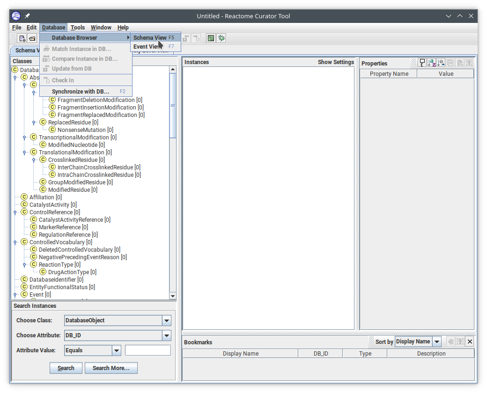
  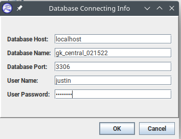

3. Save your empty rtpj project as ~/plant_reactome/r##/rtpjs/inital_rice_from_gk_central.rtpjs
  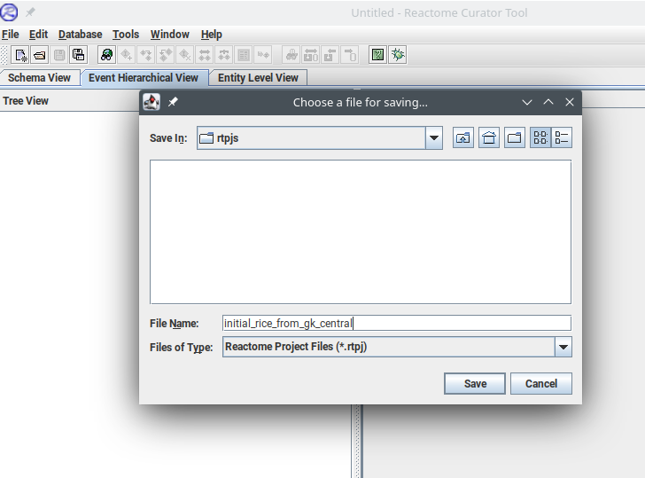
  * Once this is done, you will now have a rtpj side, and a db side. You need to move pathways/reactions from one to the other, the next step is db -> rtpj.

4. On the db side, check out the "Rice Pathways" to the rtpj
  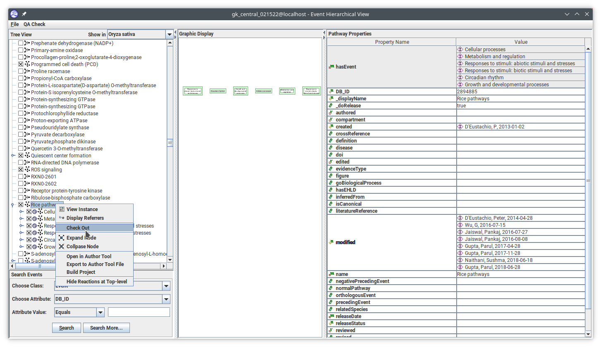
  * Once it is done "pulling all instances from the database", you will see all the pathways on the rtpj side.
  * Save the file again to have as a base.
  * Change the "Show in" at the top of the tree view to "Oryza sativa".
  * Save it as a new file "inital_rice_from_gk_central_checked_rice" for the next step.

5. On the rtpj side, from "Rice pathways" down (child of), make sure **every** single checkbox is checked. The check means "_doRelease" is marked as true.
  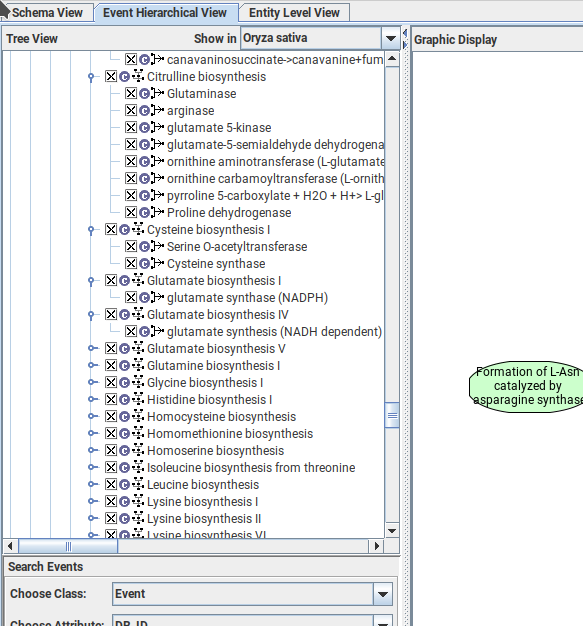
  * You will have to click on each  symbol is clicked to expand its children.
      * Most will be checked already, but not all. So they all have to be gone through.
      * Leave all children expanded, makes later steps easier.
      * Takes about an hour to go through them all.
  * Save file to "inital_rice_from_gk_central_checked_rice".

6. Remove all human pathways.
  * Change the "Show in" to Human (Homo sapiens) first.
  * Uncheck all the pathways/reactions that show up.
      * Save the file with a new name "inital_rice_from_gk_central_checked_rice_unchecked_human"
      * Some will have to be "checked out" again from the database before they can be unchecked.
          * They will look like the bottom 2 here.
          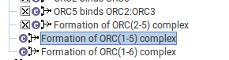
          * To do this, left click on line and then right click and choose "View instance"
          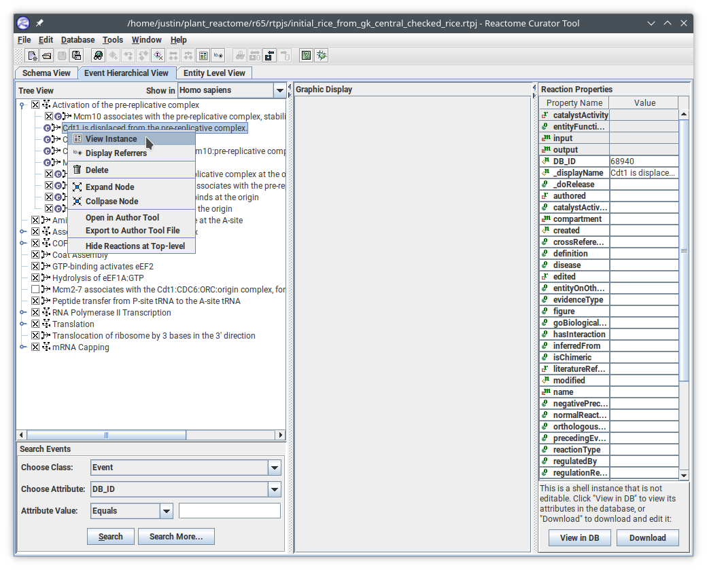
          * It will then ask if you want to see it in the database, choose "Yes".
          * A new window will pop up with "Check out" as an option at the bottom, click it to make the checkbox show up.
      * You will again have to do this for **every** instance. If a shell instance has children, has to be done for each child as well.
      * I think the easiest way to do it is check out all instances that are not available, then unchecking the parent
      * A new page will show up for each you check out, after 20 or so, close all the windows.
      * **Save frequently** as the program has a tendency to crash and take the desktop with it, requiring a reboot to fix.
  * If a box pops up that says "release was inferred from ...", click yes.
  * This process will take several hours, about 4.

7. Remove the rest of the "stowaways".
  * Change the "Show in" to All.
  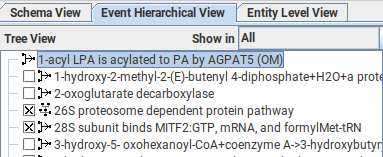
  * Save as a new copy of the file as inital_rice_from_gk_central_checked_rice_unchecked_human_no_stowaways.
  * All instances that checked will have to be unchecked that are outside of the "Rice pathways" hierarchy.
  * Process is the same as the Remove all human pathways above.
  * As you go through and check out instances, some children will show up, so it **required** to go through this process until they are all unchecked. This will take more than 10 times through.
  * This step takes 4.5-5 hours.

8. Check all changes back into the gk_central_DDMMYY database
  * Check in the unchecked (not in "Rice Pathways") first
  * No need to change/save the database as we have the original from the reactome dump
  * Every single box will need to be checked in. To do this, all children element need to be expanded.
  * Multiple items can be checked in at a time, but don't do too many, keep it to a hundred or so. Multiple can be selected by clicking the first, then holding Shift while clicking further down.
  * The first time you do a check in, you will have to choose a person. If not already in database, choose the "New instance option".
  * The check in button is the one under the mouse pointer here
    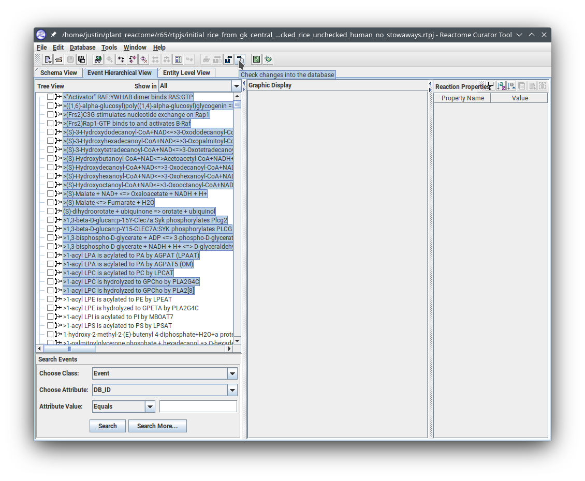
  * A box will/may pop up for ones that have no changes, close it.
    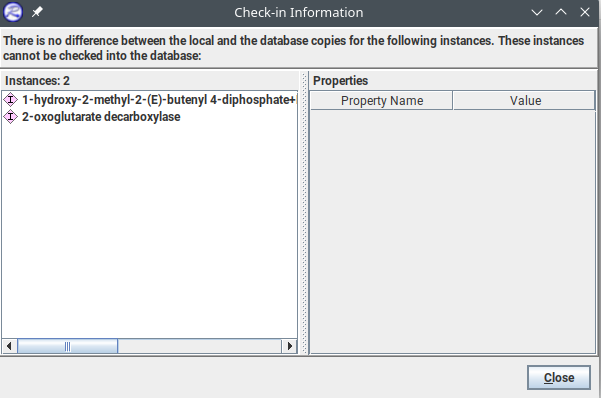
  * The ones that do get checked in will also have a pop up box, close it.
    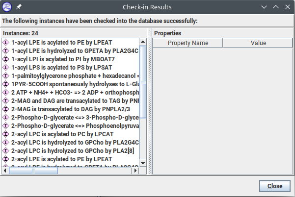
  * Go back and check in the "Rice Pathways" after the others are all done.
    * Some of them will have been unchecked because they are connected to others in some way, check them first.
    Most will have "no difference" and won't be checked in, but make sure all are attempted to check in.
  * This step takes about an hour.

9. If there are any new/changed pathways, find them and modify the "releaseDate" to the expected release date. Save to the rtpj and check in to the gk_central_DDMMYY db.

## Perfom the Slicing

1. Install the slicing tool (if needed).
  * ```
    cd ~/github/PlantReactome
    git clone https://github.com/PlantReactome/Release PlantReactome_Release
    cd PlantReactome_Release
    git checkout develop
    cd slicingTool
    ```

2. Grab the slicingTool.prop and VerXX_topics.txt from the previous version. slicingTool.prop will not be git because it contains mysql passwords.
  * Edit the slicingTool.prop file contents to the proper version for:
    * dbName
    * releaseTopicsFileName
    * releaseNumber
    * releaseDate (expected release date)
    * logFileName
    * slicingDbNamwe
    * lastReleaseDate (previous release date)

3. Run the slicing tool with the command
  `java -Xmx8G -Djava.awt.headless=true -jar ProjectSlicingTool.jar`
  * It will ask 2 questions, the first is about StableIdentifiers as true, choose true.
  * Second question is what author DB_ID to use. Find the ID in the Person table in the "Schema View"
    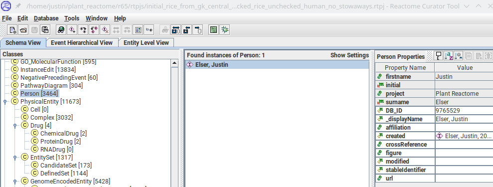
    DB_ID in screenshot above is 9765529.
  * Slicing tool will take about 10 minutes to complete.

4. Verify only Rice Pathways in slice.
  * Completely close RCT and restart it and connect to the new slice database
  If anything other than the 6 top level topics are included, write down the DB_ID for each, close RCT again and reconnect it to the gk_central db. Then check them back in to the rtpj from the db, uncheck them, then check them back in to gk_central and rerun the slicing tool after deleting the bad slice.

5. Backup the new slice once it is clean.
  *
  ```
  cd ~/plant_reactome/rYY/mysqldbs
  mysqldump -u justin -p test_slice_oryza_sativa_XX | gzip > test_slice_oryza_sativa_XX.sql.gz
  ```

## Add new taxa to slice

1. Grab the previous copy of the "test_slice_oryza_sativa_XX_full_taxa.rtpj" from the previous version file folder.

2. Close RCT and reopen with the "test_slice_oryza_sativa_XX_full_taxa.rtpj" and connect it to the "Schema view" gk_central_DDMMYY.

3. Find all new species that were added in this release and check them out from gk_central to the rtpj.
  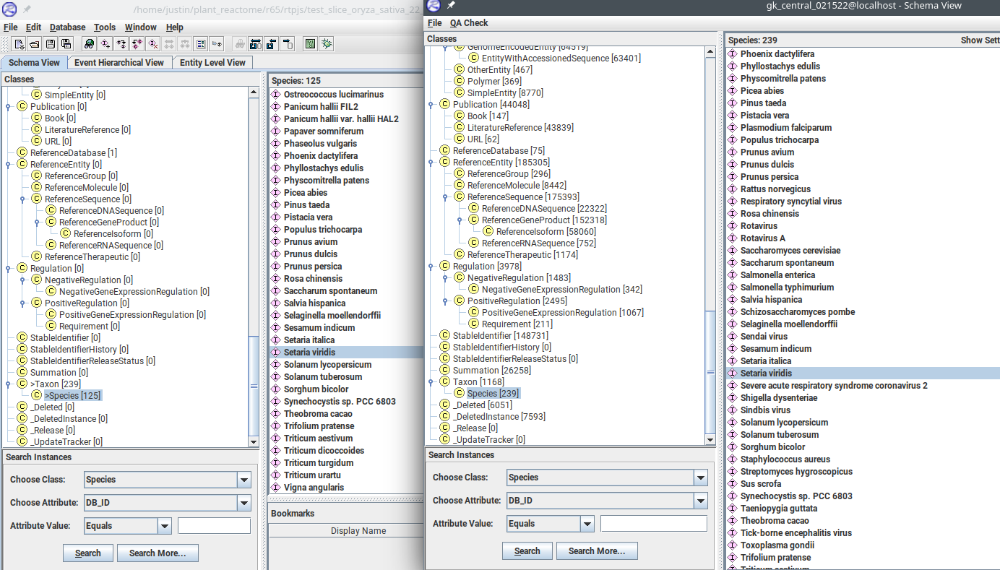

4. Switch to the "Taxon" class and also check out the class for each new genus. For example, if you added "Camelina sativa", find the genus "Camelina" in the Taxon class and check it out as well.
  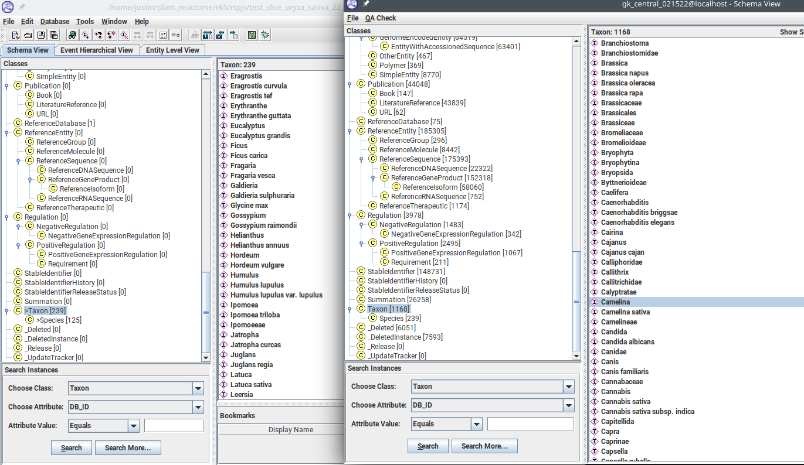
  * As you check out each genus, write down the NCBI Taxonomy ID from the "crossReference" property as that will need to be checked out as well.
  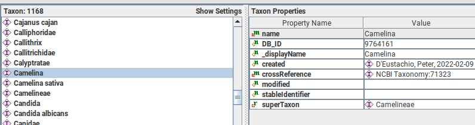
  71323 in the example here.

5. Switch to the "DatabaseIdentifier" class and find the "NCBI Taxonomy" instances you wrote down for the genus, as well as the ones for each species and check them out to the rtpj.
  * Some may be under "NCBI_taxonomy" so look there if you can't find them.
  * Not sure this step is needed as it doesn't appear to actually check anything out, but it is part of the original instructions and doesn't take long.

6. Save the file with the new slice number "test_slice_oryza_sativa_XX_full_taxa".

7. Close RCT and reopen it. This time connect to the test_slice_oryza_sativa_XX db instead of gk_central.

8. Check all the Species, Taxons, and DatabaseIdentifier instances in to the slice.
  * Because of pages that pop up, you can only do ~50 at a time.
  * Page will pop up that says the instances have been deleted from the database by another user, Choose "Yes".
  * Another popup will say "Error in transaction - Transaction cannot be used ....", choose OK. They will check in anyway.
  * The Taxons will be a bit tricky, as some of them may not check in to the database for some reason. Just skip the ones that can't be checked in.
    * The easiest way to do that is to hold "CTRL" while clicking and seeing if the check in icon turns gray, if it does, click again to skip.
    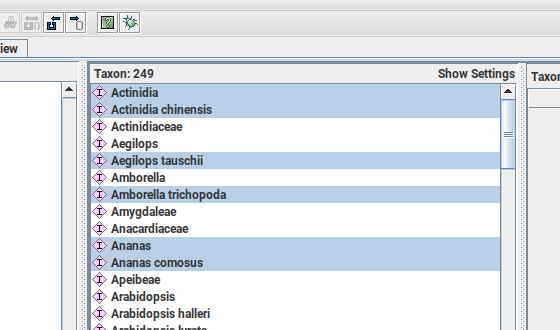
  * Just click through all the pop up boxes that come up.
  * Do it again for the DatabaseIdentifier instances as well. It will also have ones that won't go in, but not as many.
  * Backup the slice with the taxons in it
  ```
    cd ~/plant_reactome/rYY/mysqldbs
  mysqldump -u justin -p test_slice_oryza_sativa_XX | gzip > test_slice_oryza_sativa_XX_after_species.sql.gz
  ```


Next up is [Ortho-Inference](orthoinference.md)
