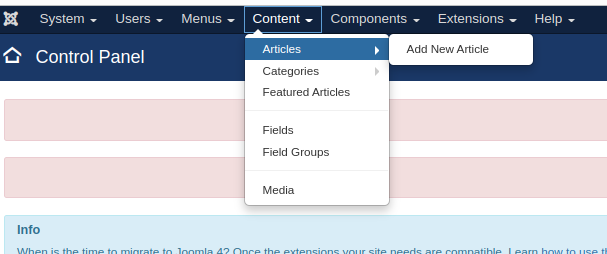
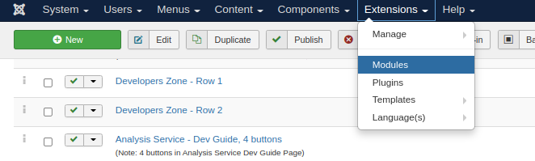

# Website Mgmt

This document outlines the process for updating the joomla pages for the release notes and home page stats.

This should be done on the dev server. The mysql database will be copied to live and the cyverse mirror during the server release migration steps.

## Logging in
The administration login page is at https://plantreactomedev.gramene.org/administrator/index.php. Because of security concerns at OICR, the joomla login requires 2-factor authentication. At this time, 2-factor authentication is handled with Google Authenticator. For now, my account is the only one with 2-factor enabled.

The password is the same as the root user for mysql.

Open the "Authenticator" app on my phone, and put in the appropriate secret key.

In case someone else needs to access, there are one time emergency passwords in files on the Jaiswal lab file server. Location is Jaiswal_Lab/Plant_Reactome/Authenticator_one_time_passwords/. Separate files for each server. These files are only visible to members of the jaiswallab group.

Note: if an emergency key is used, it will not work again. The keys are destroyed after use.

## Updating the release notes page

* Make a copy of the previous release notes page to work on. To get to it, click on Content-> Articles

and find the latest article titled "Plant Reactome Release Summary - Version..."

Open that article, change the title and alias, and save it as a copy.

Change the text as needed. If new pathways were added, check in with the curators about how to add those.

The table is a bit more involved to replace. I think the easiest way is to right click it, delete the table, then copy paste the slice_XX_stats.html file from the data exports section. The html file can be quickly copied to the clipboard with `cat slice_XX_stats.html | xclip -selection clipboard`, then just change the editor to "Code" view, find the appropriate place for the table, and paste it in.

Find the Oryza sativa row, and right click choosing Row->Cut table row, then insert the row as the second row by right-clicking the header row and choosing Row->Paste table row after.

Add two extra rows for the "Sequence Source" and "Homology Method" by right clicking the table, Column->Insert column after.

Add the headers Sequence Source and Homology Method to the new columns. Fill in the Oryza sativa with Unitprot and Curated Reference.

Probably an easier way to fill in the rest of table, but I just type it once and use middle click to paste "Ensembl Gramene" and "Compara" in to each box. Then go back and change the ones that are InParanoid and a difference Sequence Source.

Check the previous release for ones that have stars next to the species to indicate that they are from sequenced transcriptomes and add the stars.

Bold the rows for all/any new species.

## Change the links for the release notes to the new one

From the top menu, click "Menus"->Manage. Find the one labeled "Release Summary" and click it.
Clear the Select Article, and click Select to choose the new one. Don't worry about the "link", it will change to the new link after you save it automatically. Click Save and Close to save.

## Change the stats on the front page

This is under Extensions->Modules

Find the module that will have the title of the previous release, like "Version 21 (Gramene 64)"

Edit it by going to "Module Content". Change the Title to the current version.

Change the "Title 1 Text" to have an estimate of the current number of pathways total. Find these by summing in the spreadsheet with the "Projection list". Do the same for Title 2 (Reactions) and Title 3 (Genes).

Title 4 is the number of Small Molecules. Get this by going to [Content Schema](https://plantreactomedev.gramene.org/content/schema/DatabaseObject) and looking at the number for PhysicalEntity->SimpleEntity.

Title 5 is the number of projected species, so all species minus Oryza sativa.

Title 6 is Literature References. This is from the Content Schema like the Small Molecules, but "Publication"

## Have the curators and Pankaj check it out
Make any required changes.

## Backup mysql

Use this to backup the joomla mysql to be used when doing the release on live and cyverse mirror.
```
ssh plantreactome1.oicr.on.ca
cd rXX_files
mysqldump -u root -p --databases gk_joomla | gzip > gk_joomla_rXX.sql.gz
```

Last step is [Server Release/Migration](server_release_migration.md)
